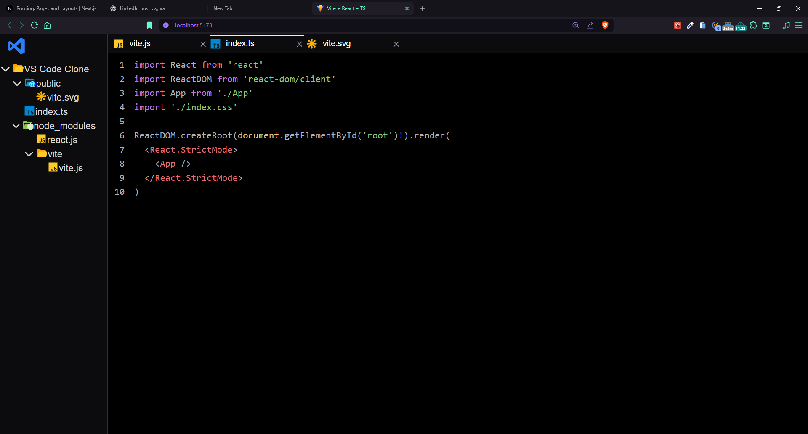

# VS Code Clone (Preview Version)

## 📌 Overview

This project is a **Visual Studio Code clone** (preview only, not a real code editor) built with **React**, **TypeScript**, and **Redux Toolkit**.
It simulates the VS Code file explorer, tab management, and basic layout — with a focus on **recursion** for file tree rendering, **state management** with Redux, and **persisting data** for a realistic experience.

The main goal was to learn and implement:

- Recursive rendering for nested folder/file structures.
- Custom state management patterns with **Redux Toolkit**.
- Data persistence using **redux-persist** to keep opened tabs and file states even after page refresh.
- Resizable panels to mimic VS Code’s layout.
- Syntax highlighting for code previews.

---

## 🛠️ Features

- **Recursive File Tree** — Fully custom recursion logic to open/close folders and display files dynamically.
- **File Tabs Management** — Open multiple files in tabs, switch between them, and keep track of the active tab.
- **Redux Toolkit Integration** — Manage file states without prop drilling.
- **Data Persistence** — Tabs and opened files remain after refresh using **redux-persist**.
- **Resizable Panels** — Drag to adjust sidebar width like VS Code.
- **Syntax Highlighting** — Styled preview for file content.
- **Dynamic File Loading** — Load data from a JSON file and determine file/folder types on the fly.

---

## 🏗️ Tech Stack

- **React** (UI)
- **TypeScript** (type safety)
- **Redux Toolkit** (state management)
- **redux-persist** (data persistence)
- **lucide-react** (icons)
- **uuid** (unique IDs)
- **Custom CSS / TailwindCSS** (styling)
- **PrismJS / syntax highlighting library** (code display)

---

## 📂 Project Structure

```
src/
│── app/
│   ├── feature/
│   │   └── fileTreeSlice.ts  # Redux slice for managing files & tabs
│   └── store.ts              # Redux store configuration
│
│── components/
│   ├── FileNode.tsx          # Recursive component for rendering file tree
│   ├── GetExtension.tsx      # Utility for displaying file/folder icons
│
│── data/
│   └── files.json            # File system structure
│
│── interfaces/               # TypeScript interfaces
│── styles/                   # Styling
│── main.tsx / App.tsx        # Entry point
```

---

## 🚀 Installation & Setup

```bash
# Clone the repository
git clone https://github.com/Ahmed-Shawki-Dev/Project4-VS-Code-Clone.git

# Navigate into the project folder
cd Project4-VS-Code-Clone

# Install dependencies
npm install

# Start the development server
npm run dev
```

The app will be available at **[http://localhost:5173](http://localhost:5173)** (Vite default port).

---

## 📖 How It Works

### 1. File Tree (Recursion)

- The `FileNode` component calls itself recursively to render nested folders and files.
- Folder state (`open/closed`) is managed locally in each instance.

### 2. File Tabs (Redux Toolkit)

- When a file is clicked:
  - If it’s already open, it’s set as the **active tab**.
  - If not, it’s added to the `openedFiles` array in Redux state.
- The `clickedFile` state keeps track of the active file’s content.

### 3. Data Persistence

- **redux-persist** stores `openedFiles` and `clickedFile` in `localStorage`.
- Refreshing the page keeps your opened tabs and active file.

### 4. Resizable Panels

- Sidebar can be resized using mouse drag — just like VS Code.

### 5. Syntax Highlighting

- File content is styled based on its extension.

---

## 📸 Screenshot



---

## 📜 License

This project is for learning purposes and is part of a course exercise.
